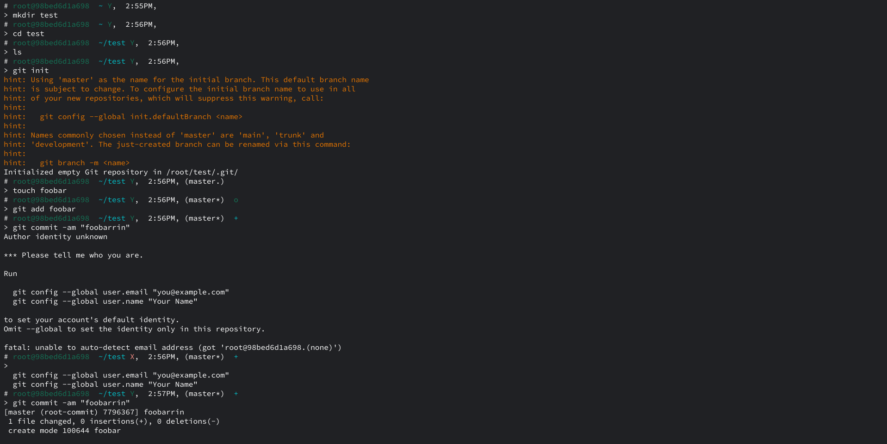

# lish
A casually designed zsh theme. No roughness, just smooth.



lish is a zsh theme that adds the most of what you need. It includes:

* user@host context
* current directory
* $? check (checks fail status)
* [git](https://git-scm.com) intergration using the [oh-my-zsh](https://github.com/ohmyzsh/ohmyzsh) library (with gwip support)
  * Signals:
  * Dirty: *
  * Clean: .
  * Added: +
  * Modified: =
  * Removed: x
  * Renamed: :
  * Unmerged: !
  * Untracked: o
  * Stashed: ^
  * Ahead: >
  * Behind: <
  * Diverged: $
  * Gwipped (gwip alias): (WIP)
* current time
* root indicator (% if user, # if root)

Install it by clonig the repository to ```$ZSH_CUSTOM/themes/lish```.
  
